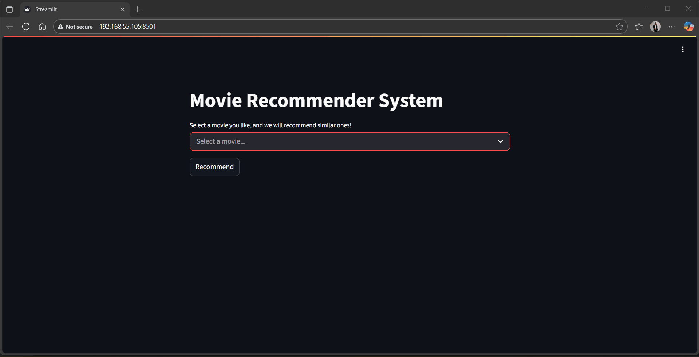

# Content-Based Movie Recommender System 🎬



➡️ [Live Demo](https://movie-recommender-05.streamlit.app/)

An intelligent movie recommender system that suggests films to users based on content similarity. This project demonstrates a complete data science workflow, from data cleaning and feature engineering to model building and deployment as an interactive web application with Streamlit.

---

## 🚀 Project Insights

- **The Power of Content-Based Filtering:** This project began by choosing a content-based approach over collaborative filtering. The key advantage is that it avoids the "cold start" problem—it can recommend new movies as soon as they are added to the dataset, without needing any user ratings.
- **Feature Engineering is Key:** The most critical step was creating a comprehensive "profile" for each movie. By combining metadata like genres, keywords, cast, and crew into a single "tags" feature, we could effectively represent each movie's essence in a way a machine learning model could understand.
- **Limitations and the "Echo Chamber":** A major insight was understanding the primary limitation of this approach. The model only recommends movies that are very similar to what the user already likes, creating a "filter bubble" or "echo chamber." It excels at finding similar content but doesn't help users discover new, diverse genres.

---

## ✨ Features
- **Content-Based Engine:** Recommends movies by calculating the cosine similarity between their content vectors.
- **Interactive Web App:** A clean and simple UI built with Streamlit for an intuitive user experience.
- **Real-Time Recommendations:** Instantly generates the top 5 most similar movies based on the user's selection.
- **Rich Dataset:** Built on the TMDB 5000 Movie Dataset, which contains detailed information on thousands of films.

---

## 🛠️ Tech Stack

- **Backend:** Python, Streamlit
- **Data Science:** Pandas, NumPy, Scikit-learn
- **Development:** Jupyter Notebook, Git & GitHub
- **Large File Handling:** Git LFS
- **Data Source:** TMDB 5000 Movie Dataset on Kaggle

---

## 🧠 How It Works

The recommendation logic is based on content-based filtering. The process is as follows:

1. **Data Loading and Preprocessing:** The `tmdb_5000_movies.csv` and `tmdb_5000_credits.csv` datasets are loaded into Pandas DataFrames. They are then merged into a single DataFrame. Irrelevant columns are dropped, and any rows with missing values are removed to ensure data quality.

2. **Feature Engineering:** A consolidated `tags` column is created for each movie. This is the most crucial step, where we create a "profile" for each film by combining its most important textual features:

   - `overview`: The plot summary.  
   - `genres`: Action, Comedy, Sci-Fi, etc.  
   - `keywords`: Key themes like 'alien', 'superhero', 'dystopia'.  
   - `cast`: The top 3 actors.  
   - `crew`: The director's name.  

   All these text features are combined into a single paragraph in the `tags` column.

3. **Text Vectorization:** The textual data in the `tags` column is converted into a numerical format that a machine can understand. Each movie's tag is transformed into a vector in a high-dimensional space using Scikit-learn's `CountVectorizer`. This process creates a large matrix where rows represent movies and columns represent unique words.

4. **Similarity Calculation:** The Cosine Similarity metric is used to calculate the similarity between every pair of movie vectors. This measures the cosine of the angle between two vectors, with a value closer to 1 indicating a higher similarity. The result is a large similarity matrix where each movie has a similarity score with every other movie.

5. **Recommendation Function:** When a user selects a movie, the system finds that movie in the dataset, retrieves its similarity scores with all other movies from the pre-computed matrix, and returns the top 5 movies with the highest scores.

---

## ⚙️ Setup and Local Installation

Follow these steps to get the project running on your local machine.

### 1. Prerequisites

- Python 3.8 or higher
- 'pip' and 'venv'
- Git and Git LFS

### 2. Clone the Repository

```
git clone https://github.com/rishii-05/movie-recommender.git
cd movie-recommender
```

### 3. Set Up a Virtual Environment

It's highly recommended to use a virtual environment to keep dependencies isolated.

```
# Create the virtual environment
python -m venv venv

# Activate it
# On Windows:
.\venv\Scripts\activate
# On macOS/Linux:
source venv/bin/activate
```

### 4. Install Git LFS and Pull Large Files

This project uses Git LFS to manage the large model files.

```
# Install Git LFS (if you haven't already)
git lfs install

# Pull the large files from LFS storage
git lfs pull
```

### 5. Install Dependencies

Install all the required libraries from the `requirements.txt` file.

```
pip install -r requirements.txt
```

### 6. Run the Streamlit Application

Now you can start the web server.

```
streamlit run app.py
```

Open your web browser and navigate to the local URL provided by Streamlit (usually http://localhost:8501) to see the application in action!

---

## 📂 Project Structure

```
movie-recommender/
|
├── artifacts/              # Stores the processed data and similarity matrix
│   ├── movie_dict.pkl
│   └── similarity.pkl
|
├── notebooks/              # Contains the Jupyter Notebook for development
│   └── main.ipynb
|
├── .gitattributes          # Configures Git LFS to track .pkl files
├── .gitignore              # Specifies files for Git to ignore
├── app.py                  # The main Streamlit application script
├── requirements.txt        # Project dependencies
├── tmdb_5000_credits.csv   # Raw data for movie credits
├── tmdb_5000_movies.csv    # Raw data for movie details
└── README.md               # You are here!
```

---

## 🔮 Future Improvements

- **Implement a Hybrid Model:** The best way to overcome the "echo chamber" effect would be to build a hybrid recommender. This would combine the current content-based model with a collaborative filtering model (using user ratings), providing recommendations that are both similar in content and liked by similar users.
- **Enhance the UI:** Improve the user interface by fetching and displaying movie posters, ratings, and release dates using the TMDB API.
- **Explore Advanced Vectorization:** For an even larger dataset, experiment with more advanced text vectorization techniques like TF-IDF or word embeddings (Word2Vec, GloVe) to capture deeper semantic relationships between movie tags.
